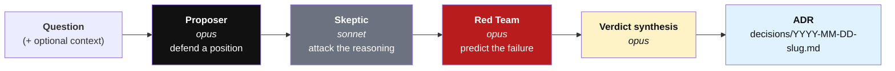
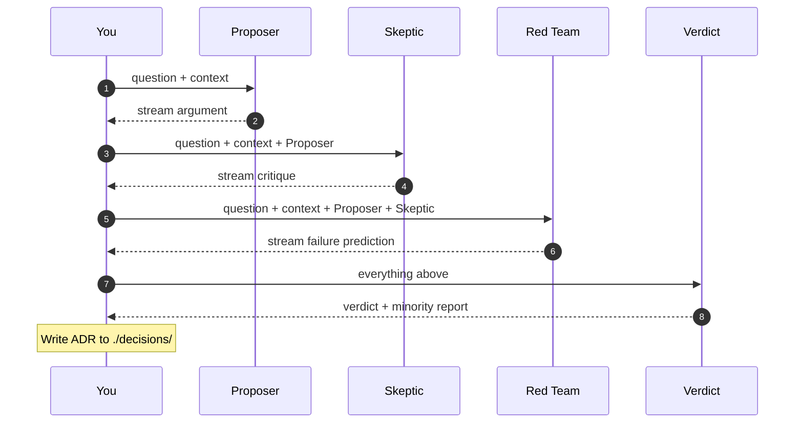
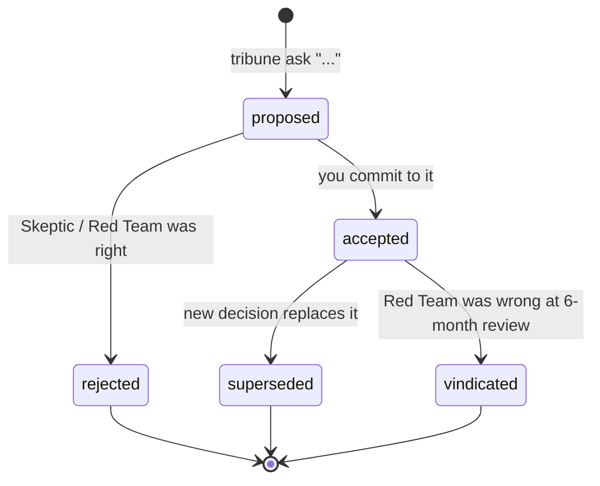

<p align="center">
  
</p>

<p align="center"><strong>A panel of advocates for hard decisions.</strong></p>

<p align="center">
  <em>Convene three voices. Argue it out. Commit the record.</em>
</p>

---

You have a decision to make. You want more than one perspective, with real disagreement baked in, and a written record at the end. **Tribune** convenes three advocates — a **Proposer**, a **Skeptic**, and a **Red Team** — argues it out, streams each voice to your terminal, and writes an ADR you can commit to your repo.

Not a chatbot. Not an SDLC framework. A decision instrument.

```
tribune ask "Should we migrate the audit log to Postgres or keep SQLite?"
```

## The three voices

The logo is the panel. Each vertex is a voice.

<table>
  <tr>
    <td width="80" align="center"></td>
    <td>
      <strong>Proposer</strong> (top) — argues the most defensible answer in under 400 words. Commits to a position.<br>
      <strong>Skeptic</strong> (bottom-left) — attacks the reasoning, not the conclusion. Finds the weakest link.<br>
      <strong>Red Team</strong> (bottom-right, in red) — predicts how this decision fails in six months, names the signal to watch for.
    </td>
  </tr>
</table>

## Install

Tribune uses **your AI CLI subscriptions**, not API keys. Each voice shells out to whichever CLI the panel specifies.

```bash
# Required: Claude Code (used by the default panel)
# https://docs.claude.com/en/docs/claude-code/overview
claude --version

# Optional: Codex CLI + Gemini CLI (needed for --panel cross-provider)
codex --version
gemini --version

# Install Tribune
pip install tribune-cli
```

No `ANTHROPIC_API_KEY` required. No billing surprises.

## Use

```bash
tribune ask "Should we migrate the audit log to Postgres or keep SQLite?"
tribune ask "Which auth library for the new service?" --context ./notes.md
tribune ask "Kill or keep the batch import feature?" --out ./adr

# Pick a panel (see Panels below)
tribune ask "..." --panel cross-provider
tribune ask "..." --panel linus
```

Three advocates speak in turn, streamed live. When they're done, Tribune writes a markdown ADR to `./decisions/` with the verdict and the strongest unresolved objection.

Commit it. Review it in six months. See whether the Red Team was right.

## Inside Claude Code

Convene a tribune without leaving your Claude Code session. Copy the slash command into your global commands directory:

```bash
mkdir -p ~/.claude/commands
curl -fsSL https://raw.githubusercontent.com/ao92265/tribune/main/.claude/commands/tribune.md \
  -o ~/.claude/commands/tribune.md
```

Then from any Claude Code session:

```
/tribune Should we migrate the audit log to Postgres or keep SQLite?
```

Claude will shell out to `tribune ask`, stream the three advocates, and offer to commit the ADR.

## How it works

### 1. Panel flow

Each voice speaks in sequence. Later voices see earlier voices.



**Why Sonnet for the Skeptic?** Different model → genuine divergence, not three flavours of the same voice. The Skeptic is the hardest role; if it's weak, Tribune is just a fancier chatbot.

### 2. What each voice sees

Context flows forward. Nobody sees the Verdict except the reader of the ADR.



### 3. Decision lifecycle

Tribune writes an ADR. You own what happens to it.



## Panels

A **panel** is the roster of voices Tribune convenes. You can use a built-in panel, write your own, or install someone else's.

### Built-in

| Name | Voices |
|---|---|
| `default` | Claude Opus (Proposer, Red Team, Synth) + Claude Sonnet (Skeptic). |
| `cross-provider` | Claude Proposer + **Codex** Skeptic + **Gemini** Red Team + Claude synth. Genuine provider divergence. |

> **Streaming:** Claude and Gemini voices stream token-by-token. The Codex voice captures its final message cleanly (codex stdout is too noisy to stream raw), so expect a pause before the Codex block appears — then the full response in one burst.

List, inspect, and install:

```bash
tribune panel list
tribune panel show default
tribune panel install ./examples/panels/linus.toml
```

### Custom personas

Panels are TOML files. Drop them in `~/.config/tribune/panels/` or `./.tribune/panels/` and Tribune picks them up. Minimal shape:

```toml
name = "linus"
description = "Principled-engineer trio."

[proposer]
bin = "claude"          # one of: claude | codex | gemini
model = "opus"          # optional; CLI default if omitted
system = """
You are an experienced kernel maintainer ...
"""

[skeptic]
bin = "claude"
model = "sonnet"
system = """..."""

[red_team]
bin = "claude"
model = "opus"
system = """..."""

[synth]
bin = "claude"
model = "opus"
system = """..."""
```

See [`examples/panels/linus.toml`](examples/panels/linus.toml) for a full working example.

### Shareable rosters

A panel is one file. Share it like any file:

```bash
# Someone sends you linus.toml or you find it in a repo
tribune panel install ./linus.toml
tribune ask "..." --panel linus
```

Tribune verifies the TOML parses and the voices are valid before it installs.

## Review a git diff

Convene the panel on code, not just decisions.

```bash
git add -p                              # stage the changes you want reviewed
tribune review                          # review staged diff
tribune review --ref HEAD               # review the last commit
tribune review --ref HEAD --panel cross-provider
```

Tribune asks: *"Should this diff be committed as-is, or does it hide a regression, scope-creep, or a failure mode a future maintainer will curse you for?"* Proposer argues ship-it. Skeptic attacks the reasoning. Red Team predicts the bug in six months. Synth picks.

Wire it into your pre-commit hook if you want every commit on the record:

```bash
#!/bin/sh
# .git/hooks/pre-commit
tribune review --out ./decisions || exit 1
```

Tribune will not install the hook for you. Your repo, your call.

## Output

A file at `./decisions/YYYY-MM-DD-slugified-question.md`:

```markdown
# Decision: Wraith audit log storage

Date: 2026-04-22
Status: proposed
Panel: default

## Question
Should Wraith use Postgres or SQLite for the audit log?

## Context
_No context provided._

## Panel

### Proposer — claude:opus
Use Postgres. The audit log will be queried by compliance reviewers ...

### Skeptic — claude:sonnet
The Proposer assumes the compliance query pattern exists. Today there is ...

### Red Team — claude:opus
This fails when the ops team doesn't budget a Postgres instance ...

## Verdict
Use Postgres, but only after the first real compliance query lands ...

## Minority report
"The Proposer assumes the compliance query pattern exists."
```

Each advocate's header records the CLI and model used — so when you come back to the ADR in six months, you know exactly which voice said what.

## Why

Most AI dev tools collaborate. They agree with you, build what you ask, and ship. That's fine for code. It's dangerous for decisions.

Every serious decision needs a dissent. Tribune forces it.

Inspired by the Roman tribunes who spoke for the plebeians against the senate. Your advocate, on the record.

## What's in

- Three advocates on every decision. Synthesis writes the verdict.
- Subscription auth via `claude` / `codex` / `gemini` CLIs. No API keys.
- Built-in `default` and `cross-provider` panels.
- Custom personas via TOML files.
- Shareable rosters (`tribune panel install <file>`).
- Git diff review (`tribune review`).
- ADR file you commit to your repo.
- Claude Code slash command (`/tribune`).

## What's not in Tribune, deliberately

These aren't roadmap items. They're design decisions.

- **No web UI.** Tribune is a decision instrument, not a chatbot.
- **No hosted service.** Your decisions belong in your repo, not someone else's database.
- **No telemetry.** Tribune never phones home. Your questions are yours.

Anything in this list would be a different product.

## License

MIT.
