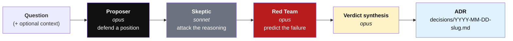
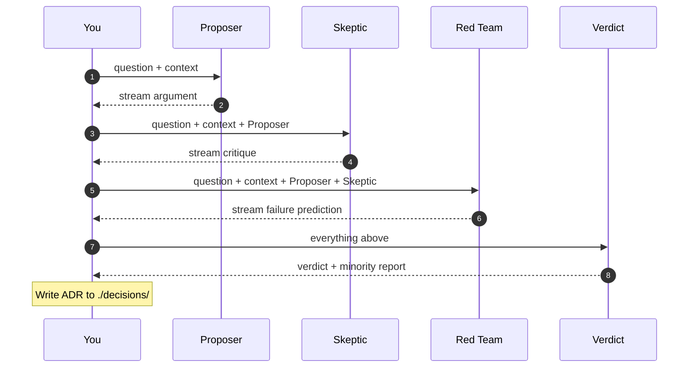
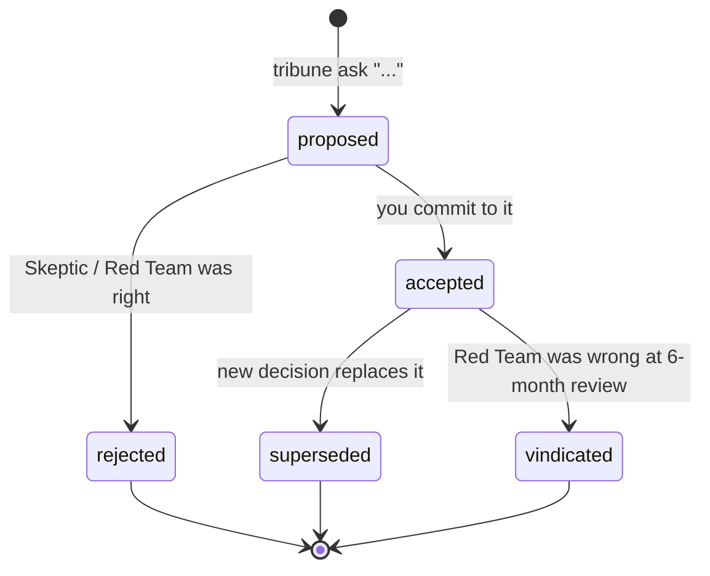

<p align="center">
  
</p>

<p align="center"><strong>A panel of advocates for hard decisions.</strong></p>

<p align="center">
  <em>Convene three voices. Argue it out. Commit the record.</em>
</p>

---

You have a decision to make. You want more than one perspective, with real disagreement baked in, and a written record at the end. **Tribune** convenes three advocates — a **Proposer**, a **Skeptic**, and a **Red Team** — argues it out, streams each voice to your terminal, and writes an ADR you can commit to your repo.

Not a chatbot. Not an SDLC framework. A decision instrument.

```
tribune ask "Should we migrate the audit log to Postgres or keep SQLite?"
```

## The three voices

The logo is the panel. Each vertex is a voice.

<table>
  <tr>
    <td width="80" align="center"></td>
    <td>
      <strong>Proposer</strong> (top) — argues the most defensible answer in under 400 words. Commits to a position.<br>
      <strong>Skeptic</strong> (bottom-left) — attacks the reasoning, not the conclusion. Finds the weakest link.<br>
      <strong>Red Team</strong> (bottom-right, in red) — predicts how this decision fails in six months, names the signal to watch for.
    </td>
  </tr>
</table>

## Install

Tribune uses **your Claude Pro/Max subscription**, not an API key. It shells out to the [Claude Code CLI](https://docs.claude.com/en/docs/claude-code/overview).

```bash
# 1. Install Claude Code (one-time)
#    https://docs.claude.com/en/docs/claude-code/overview
claude --version

# 2. Install Tribune
pip install tribune-cli
```

No `ANTHROPIC_API_KEY` required. No billing surprises.

## Use

```bash
tribune ask "Should we migrate the audit log to Postgres or keep SQLite?"
tribune ask "Which auth library for the new service?" --context ./notes.md
tribune ask "Kill or keep the batch import feature?" --out ./adr
```

Three advocates speak in turn, streamed live. When they're done, Tribune writes a markdown ADR to `./decisions/` with the verdict and the strongest unresolved objection.

Commit it. Review it in six months. See whether the Red Team was right.

## How it works

### 1. Panel flow

Each voice speaks in sequence. Later voices see earlier voices.



**Why Sonnet for the Skeptic?** Different model → genuine divergence, not three flavours of the same voice. The Skeptic is the hardest role; if it's weak, Tribune is just a fancier chatbot.

### 2. What each voice sees

Context flows forward. Nobody sees the Verdict except the reader of the ADR.



### 3. Decision lifecycle

Tribune writes an ADR. You own what happens to it.



## Output

A file at `./decisions/YYYY-MM-DD-slugified-question.md`:

```markdown
# Decision: Wraith audit log storage

Date: 2026-04-22
Status: proposed

## Question
Should Wraith use Postgres or SQLite for the audit log?

## Context
_No context provided._

## Panel

### Proposer
Use Postgres. The audit log will be queried by compliance reviewers ...

### Skeptic
The Proposer assumes the compliance query pattern exists. Today there is ...

### Red Team
This fails when the ops team doesn't budget a Postgres instance ...

## Verdict
Use Postgres, but only after the first real compliance query lands ...

## Minority report
"The Proposer assumes the compliance query pattern exists."
```

## Why

Most AI dev tools collaborate. They agree with you, build what you ask, and ship. That's fine for code. It's dangerous for decisions.

Every serious decision needs a dissent. Tribune forces it.

Inspired by the Roman tribunes who spoke for the plebeians against the senate. Your advocate, on the record.

## What's in v0

Three hardcoded advocates. One question at a time. Markdown output. Claude subscription auth. That's it.

## What's not in v0, deliberately

- Custom personas
- Shareable rosters
- Multi-provider advocates (Claude + Codex + Gemini panels) — [tracked as v1](https://github.com/ao92265/tribune/issues)
- Git hooks
- Web UI
- Hosted service
- Telemetry

If v0 gets run a second time by real users without being asked, v1 happens. If not, Tribune stays small and honest.

## License

MIT.
